# Wu matrix + Wang + Zhang：短测试结果

这两次是 `wu_matrix_wang_zhang.py` 的短测试，用来确认程序能跑完。数字不是论文复现，也不能拿来和 PINN 基线或已发表结果比较。

SOH 是分数：`容量 / 1.1 Ah`。MAPE 是相对真实 SOH 的百分比。指标按测试样本加权。检查点是验证集上 Wang `solution_u` 的 MSE 最低的那一轮；这两次里，最好的一轮都是最后一轮（epoch 1，从 0 数起）。没有出现 SOH 为 0 的样本。

运行环境：CPU，Python 3.12.3，torch 2.14.0+cu130。设置：2 个 epoch，窗口 16，步长 5，k=2，batch 64，每边最多 3/1/1 节电池。

## MIT

留出条件 `2018-04-12`。测试电池 `2018-04-12_battery-1`，182 个样本。训练电池：`2017-05-12_battery-10`、`2017-06-30_battery-1`、`2017-05-12_battery-11`。验证电池：`2017-05-12_battery-1`。验证集 Wang MSE：0.373486。

| 模型 | MAE | MAPE % | RMSE | MSE |
| --- | --- | --- | --- | --- |
| Wang | 0.584366 | 61.4374 | 0.645352 | 4.164798e-01 |
| Zhang | 5.026066 | 531.9764 | 6.109314 | 3.732371e+01 |

原始文件在 `MIT_2018-04-12_20260926_142820/`：`metrics.json`、`log.txt`、`config.json`、`test_predictions.npz`、`best_wang_valid.pt`。

图表在 `figures/`。

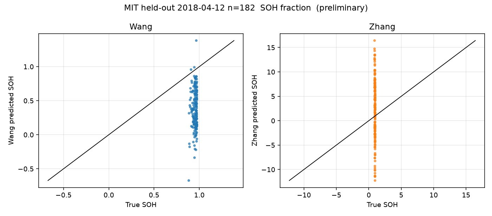

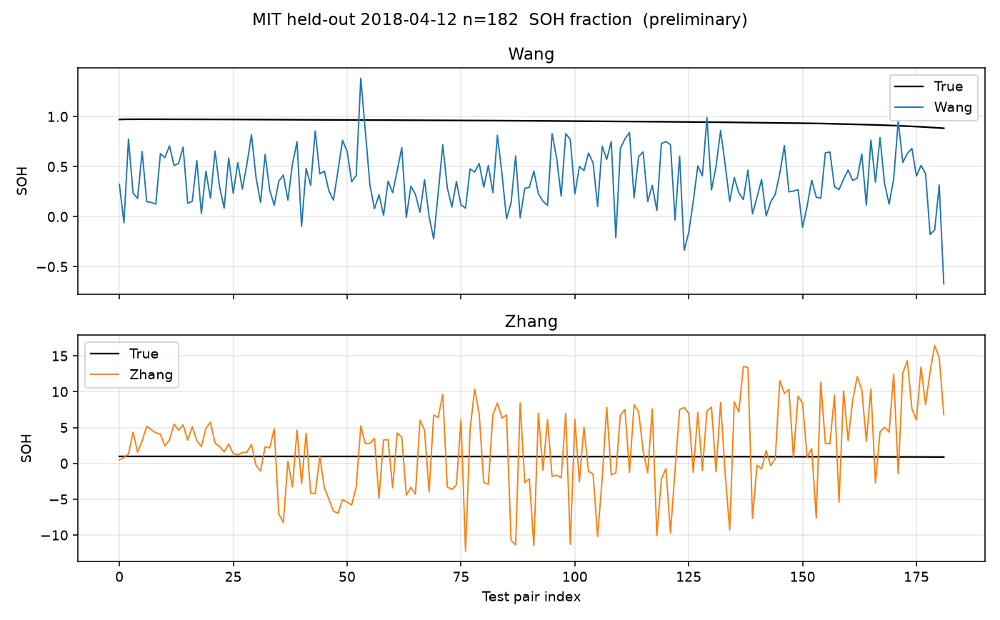

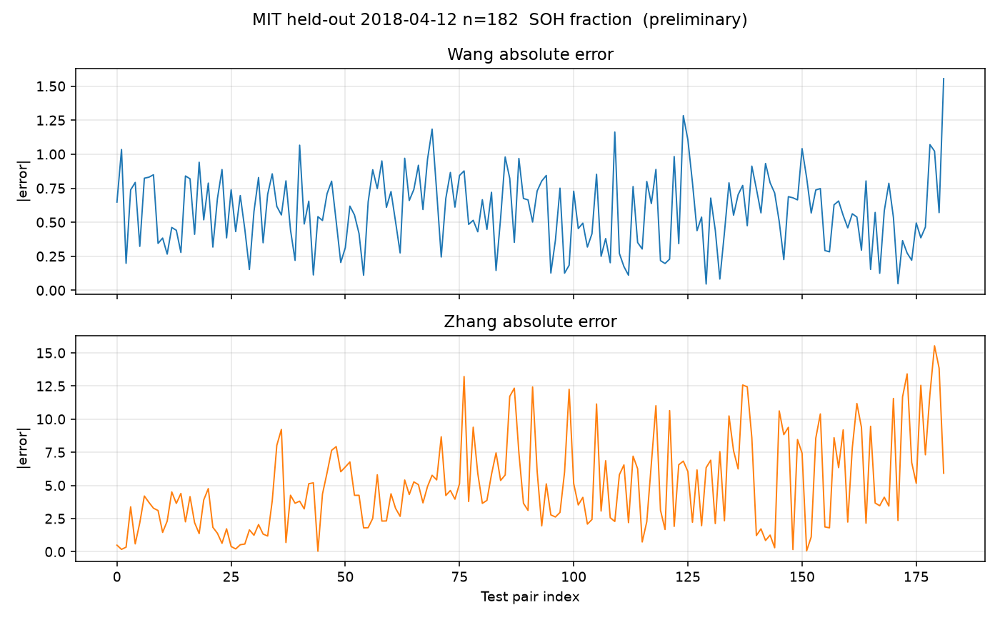

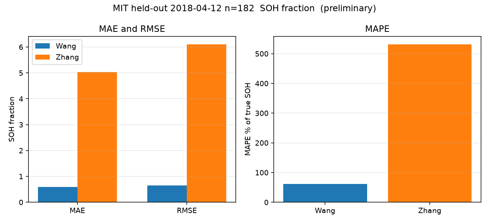

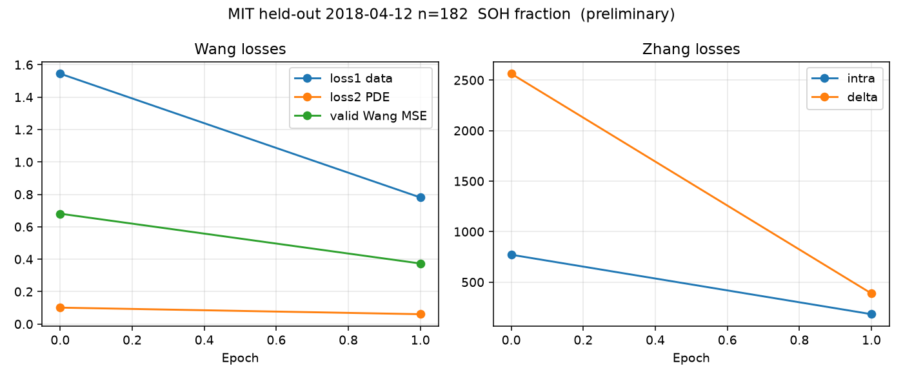

## HUST

留出组 `10`。测试电池 `10-1`，336 个样本。训练电池：`1-1`、`2-2`、`3-1`。验证电池：`1-2`。验证集 Wang MSE：0.056704。

| 模型 | MAE | MAPE % | RMSE | MSE |
| --- | --- | --- | --- | --- |
| Wang | 0.189353 | 19.1884 | 0.241890 | 5.851075e-02 |
| Zhang | 1.822809 | 189.0067 | 2.362972 | 5.583635e+00 |

原始文件在 `HUST_10_20260926_142824/`。

图表在 `figures/`。

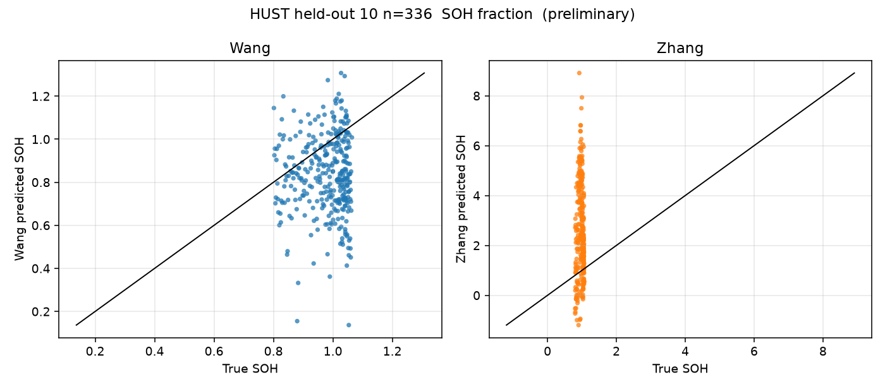

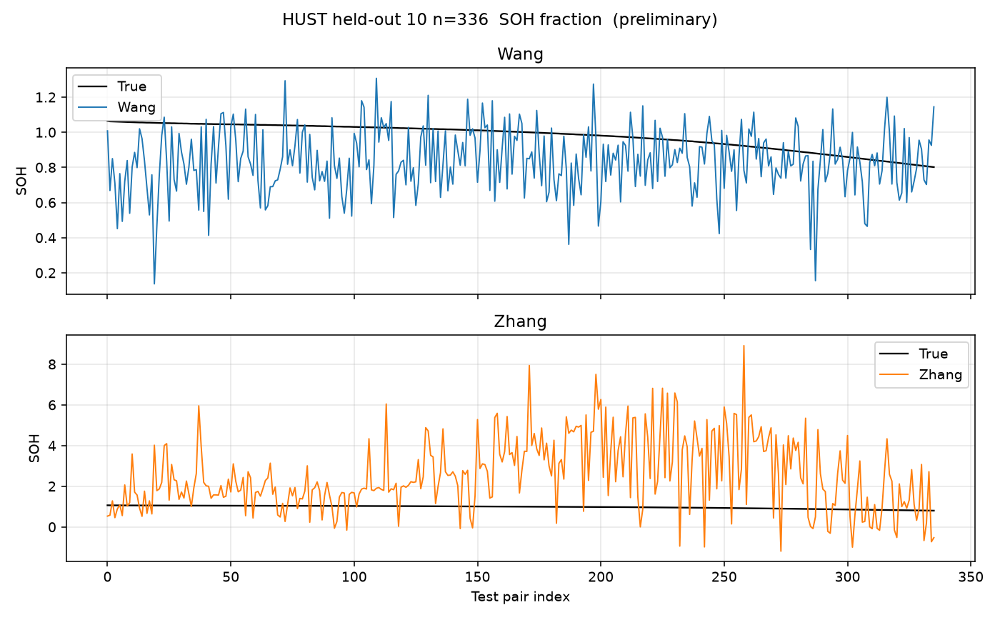

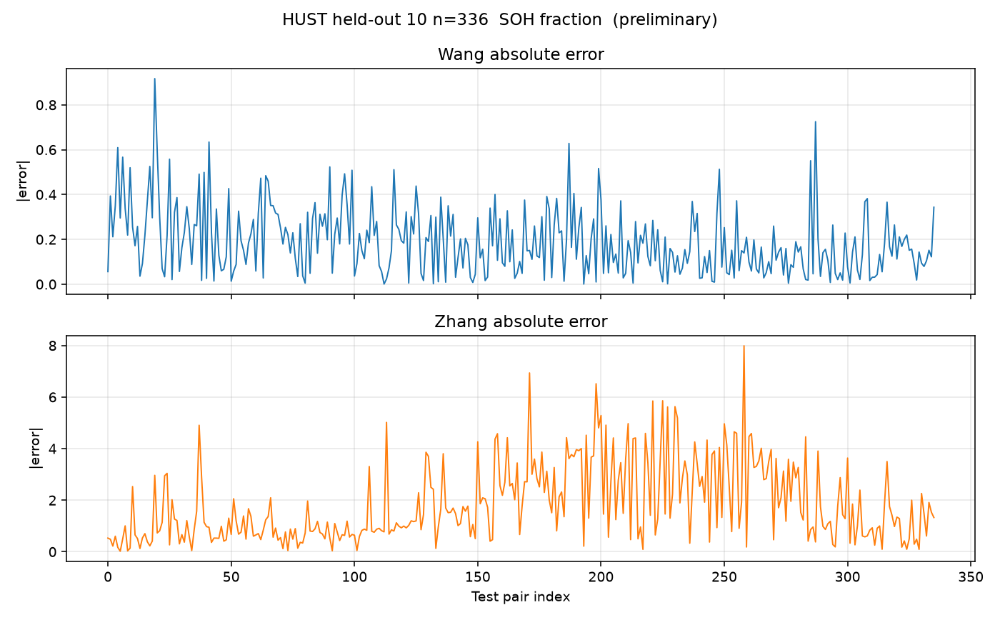

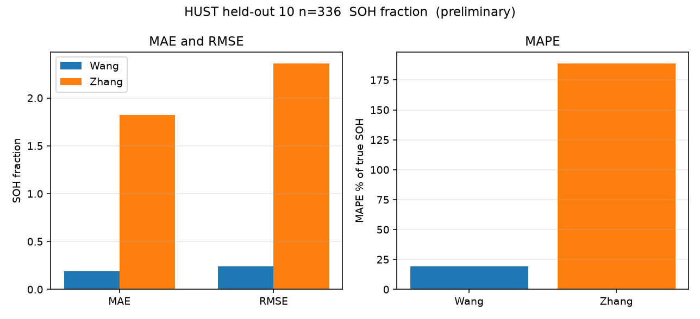

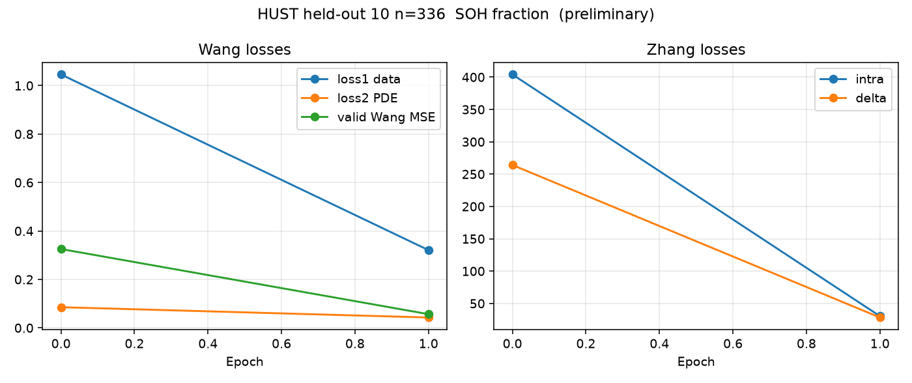

## 两次对比

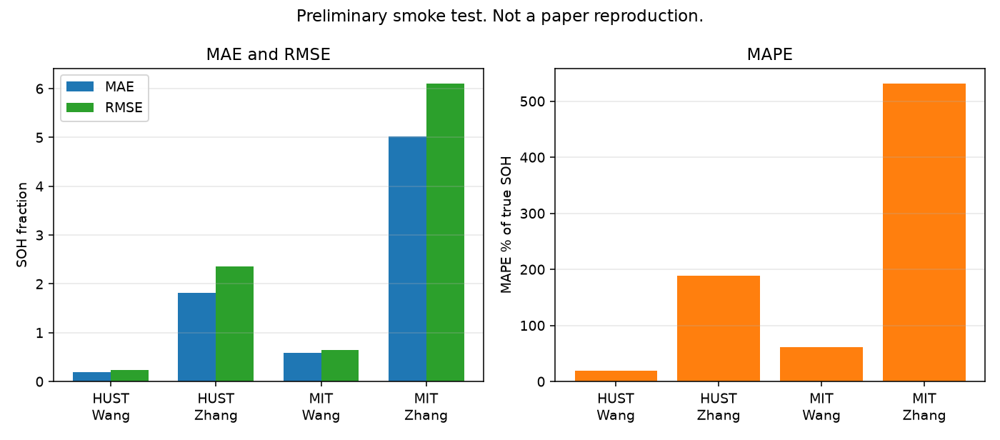

Zhang 的误差大，是因为周期矩阵仍用清洗后的原始特征尺度，而且只训练了 2 个 epoch。画图代码在仓库根目录的 `wu_matrix_wang_zhang.py` 里。重新出图：

```bash
python3 wu_matrix_wang_zhang.py --plot-from results/wu_wang_zhang --figures-dir results/wu_wang_zhang/figures
```
